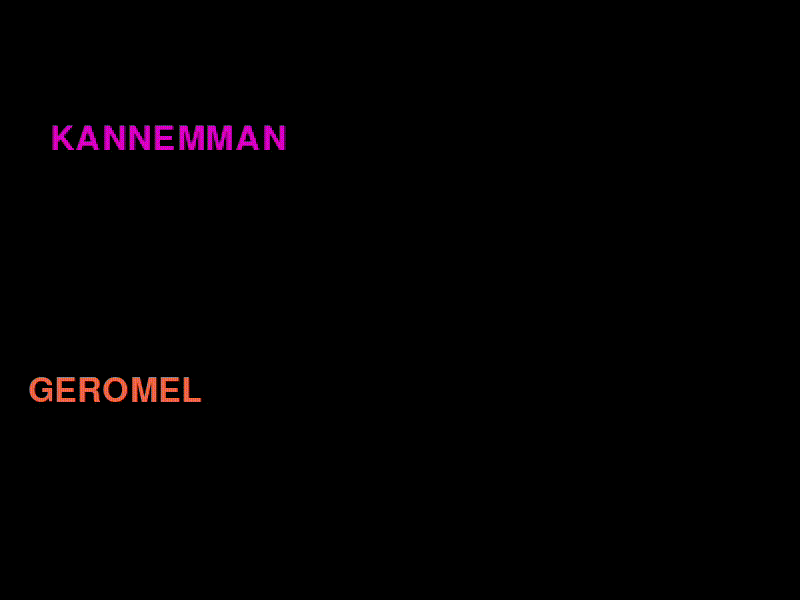

# 🎮 DVD Bounce com Pygame

Este projeto é uma pequena simulação feita em **Python** utilizando a biblioteca **Pygame**, onde dois textos se movimentam pela tela, quicam nas bordas da janela e colidem entre si trocando de direção.

<p align="center">
  
</p>

Quando eles batem:
* Mudam de direção.
* Trocam suas velocidades.
* Mudam de cor aleatoriamente.

---

## 📦 Tecnologias utilizadas

* Python 3
* Pygame

---

## 🖥️ O que o programa faz

O programa abre uma janela de **800x600 pixels** onde dois textos ficam se movendo continuamente.

Eles possuem:

* Velocidade aleatória inicial
* Detecção de colisão com bordas
* Detecção de colisão entre si
* Mudança de cor dinâmica

---

## 🧠 Estrutura do código

O código foi organizado em funções.

### Função `gerar_velocidade()`

Gera uma velocidade aleatória para o texto.

Ela garante que a velocidade **não seja (0,0)** para que o objeto não fique parado.

```python
def gerar_velocidade():
    while True:
        vx = random.randint(-1, 1)
        vy = random.randint(-1, 1)
        if vx != 0 or vy != 0:
            return vx, vy
```

---

### Função `cor_aleatoria()`

Gera uma cor RGB aleatória.

```python
def cor_aleatoria():
    return (
        random.randint(1, 255),
        random.randint(1, 255),
        random.randint(1, 255),
    )
```

Usada quando ocorre colisão.

---

### Função `criar_texto()`

Responsável por:

* Renderizar o texto na tela
* Criar o retângulo de colisão (`rect`)
* Definir a posição inicial

```python
def criar_texto(fonte, texto_str, cor, posicao):
    texto = fonte.render(texto_str, True, cor)
    rect = texto.get_rect(center=posicao)
    return texto, rect
```

---

### Função `atualizar_colisao_borda()`

Verifica se o texto bateu nas bordas da tela. Quando isso acontece:

* A direção muda
* A cor do texto muda

```python
def atualizar_colisao_borda(rect, vx, vy, fonte, texto_str):
    mudou = False

    if rect.right >= largura:
        vx = random.randint(-1, 0)
        vy = random.randint(-1, 1)
        mudou = True

    elif rect.left <= 0:
        vx = random.randint(0, 1)
        vy = random.randint(-1, 1)
        mudou = True

    if rect.bottom >= altura:
        vx = random.randint(-1, 1)
        vy = random.randint(-1, 0)
        mudou = True

    elif rect.top <= 0:
        vx = random.randint(-1, 1)
        vy = random.randint(0, 1)
        mudou = True

    if mudou:
        texto = fonte.render(texto_str, True, cor_aleatoria())
        return vx, vy, texto

    return vx, vy, None
```

### Função `main()`

É o coração do programa, responsável por:

* Inicializar o Pygame
* Criar a janela
* Criar os textos
* Controlar o loop principal
* Atualizar movimento e colisões
* Renderizar os elementos na tela

```python
def main():
    pygame.init()

    tela = pygame.display.set_mode((largura, altura))
    pygame.display.set_caption("Janela")

    clock = pygame.time.Clock()
    fonte = pygame.font.SysFont(None, tamanho_fonte)

    texto1, rect1 = criar_texto(fonte, texto_str, BRANCO, (200, 300))
    vx1, vy1 = gerar_velocidade()

    texto2, rect2 = criar_texto(fonte, texto2_str, BRANCO, (600, 300))
    vx2, vy2 = gerar_velocidade()

    rodando = True
    while rodando:
        for evento in pygame.event.get():
            if evento.type == pygame.QUIT:
                rodando = False

        tela.fill(PRETO)

        rect1.x += vx1
        rect1.y += vy1
        rect2.x += vx2
        rect2.y += vy2

        vx1, vy1, novo_texto1 = atualizar_colisao_borda(rect1, vx1, vy1, fonte, texto_str)
        vx2, vy2, novo_texto2 = atualizar_colisao_borda(rect2, vx2, vy2, fonte, texto2_str)

        if novo_texto1:
            texto1 = novo_texto1
        if novo_texto2:
            texto2 = novo_texto2

        if rect1.colliderect(rect2):
            vx1, vx2 = vx2, vx1
            vy1, vy2 = vy2, vy1

            texto1 = fonte.render(texto_str, True, cor_aleatoria())
            texto2 = fonte.render(texto2_str, True, cor_aleatoria())

        tela.blit(texto1, rect1)
        tela.blit(texto2, rect2)

        pygame.display.flip()
        clock.tick(fps)

    pygame.quit()
    sys.exit()
```

---

## 💥 Colisão entre os textos

A colisão é detectada usando:

```python
rect1.colliderect(rect2)
```

Quando os textos se encostam:

* As velocidades são trocadas
* A cor dos dois muda

Isso cria um efeito de **troca de movimento**, simulando um impacto simples.
