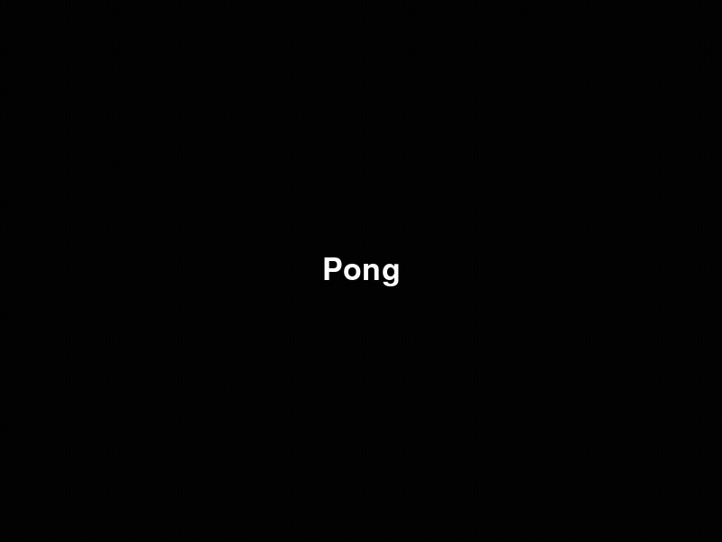

# 🏓 Pong Game 
Este projeto é uma implementação clássica do jogo Pong feita em Python utilizando a biblioteca Pygame. O jogo coloca um jogador humano contra uma inteligência artificial simples (CPU) em uma disputa de 10 pontos.

<p align="center">
  
</p>

O jogo apresenta:
- Menu inicial interativo.
- Movimentação fluida das raquetes.
- Sistema de pontuação em tempo real.
- Uma CPU que segue a trajetória da bola.

---

## 📦 Tecnologias utilizadas
- Python 3
- Pygame

---

## 🖥️ O que o programa faz
O programa abre uma janela de 800x600 pixels e inicia em uma tela de menu. Após pressionar a tecla de espaço, o jogo começa.

As principais mecânicas são:
- Jogador: Controlado pelas setas (Cima/Baixo).
- CPU: Segue automaticamente a posição vertical da bola.
- Colisão: A bola rebate nas raquetes e nas bordas superiores/inferiores.
- Pontuação: Quando a bola sai pelas laterais, o ponto é computado e a bola retorna ao centro.
- Condição de Vitória: O jogo encerra e volta ao menu quando alguém atinge 10 pontos.

---

## 🧠 Estrutura do código
O código foi organizado utilizando Orientação a Objetos e dividido em dois módulos principais para separar a lógica de negócio da interface gráfica.

### 📄 `entities.py`
Este módulo contém as "regras do mundo" e as entidades físicas do jogo:

#### Classe `Player`:
Representa as raquetes. Define as dimensões, velocidade e os métodos de movimentação e desenho.

```Python
class Player:
    def __init__(self, x, y, width, height):
        self.rect = pygame.Rect(x, y, width, height)
        self.speed = 5
        self.score = 0

    def move_up(self):
        if self.rect.y > 0:
            self.rect.y -= self.speed

    def move_down(self):
        if self.rect.y < HEIGHT - self.rect.height:
            self.rect.y += self.speed

    def draw(self, screen, color):
        pygame.draw.rect(screen, color, self.rect)
```

#### Classe `Ball`
Controla a física da bola, sua direção aleatória inicial, o método de reset após um ponto e desenho.

```Python
class Ball:
    def __init__(self, x, y, size):
        self.size = size
        self.rect = pygame.Rect(x, y, size, size)
        self.speed_x = 0
        self.speed_y = 0
        self.reset()

    def move(self):
        self.rect.x += self.speed_x
        self.rect.y += self.speed_y

    def reset(self):
        self.rect.x = WIDTH//2 - self.size//2
        self.rect.y = HEIGHT//2 - self.size//2
        self.speed_x = random.choice([-5, 5])
        self.speed_y = random.choice([-5, -4, -3, -2, -1, 1, 2, 3, 4, 5])

    def draw(self, screen, color):
        pygame.draw.circle(screen, color, self.rect.center, self.size)
```

#### Classe `KeyboardController`
Contém a lógica da movimentação do jogador, caso clique na seta para cima a raquete sobe, caso contrário, desce.

```Python
class KeyboardController:
    def update(self, player):
        keys = pygame.key.get_pressed()
        if keys[pygame.K_UP]:
            player.move_up()
        if keys[pygame.K_DOWN]:
            player.move_down()
```

#### Classe `CpuController`
Contém a lógica da CPU, que ajusta a posição do Player 2 com base na posição central da bola.

```Python
class CpuController:
    def update(self, player, ball):
        if player.rect.centery < ball.rect.centery:
            player.move_down()
        elif player.rect.centery > ball.rect.centery:
            player.move_up()
```

#### Classe `PhysicsManager`
Responsável por gerenciar todas as colisões físicas e a lógica de pontuação do jogo.

```Python
class PhysicsManager:
    def handle_collisions(self, ball, player1, player2):
        if ball.rect.colliderect(player1.rect) or ball.rect.colliderect(player2.rect):
            ball.speed_x *= -1

        if ball.rect.y <= 0 or ball.rect.y >= HEIGHT - ball.size:
            ball.speed_y *= -1

    def check_scoring(self, ball, player1, player2):
        if ball.rect.x <= 0:
            player2.score += 1
            ball.reset()
            return True
        if ball.rect.x >= WIDTH - ball.size:
            player1.score += 1
            ball.reset()
            return True
        return False
```

### 📄 `pong.py`
Este módulo é o ponto de entrada do programa e cuida da orquestração e exibição:

#### Classe `Menu`
Gerencia o estado inicial do programa, lidando com a tela de espera e a transição para o início da partida.

```Python
class Menu:
    def __init__(self, screen):
        self.screen = screen
        self.running = True

    def run(self):
        while self.running:
            self.handle_events()
            self.draw()
```

#### Classe `Game`
É a classe orquestradora. Ela utiliza Injeção de Dependência para receber os elementos, controladores e gerenciar o loop principal do jogo (Processamento, Atualização e Desenho).

```Python
class Game:
     def __init__(self, screen, player1, player2, ball, ctrl_player1, ctrl_player2, ctrl_physics):
        self.screen = screen
        self.player1 = player1
        self.player2 = player2
        self.ball = ball
        self.ctrl_player1 = ctrl_player1
        self.ctrl_player2 = ctrl_player2
        self.physics = ctrl_physics

    def update(self):
        self.ball.move()
        self.ctrl_player1.update(self.player1)
        self.ctrl_player2.update(self.player2, self.ball)
        self.physics.handle_collisions(self.ball, self.player1, self.player2)
        self.physics.check_scoring(self.ball, self.player1, self.player2)
```

#### Função `main()`
Orquestra o fluxo principal, alternando entre a instância do Menu e a instância do Game.

```Python
def main():
    pygame.init()
    screen = pygame.display.set_mode((WIDTH, HEIGHT))
    pygame.display.set_caption("Pong")

    while True:
        menu = Menu(screen)
        menu.run()

        player1 = Player(15, HEIGHT//2 - RACKET_HEIGHT//2, RACKET_WIDTH, RACKET_HEIGHT)
        player2 = Player(WIDTH - 15 - RACKET_WIDTH, HEIGHT//2 - RACKET_HEIGHT//2, RACKET_WIDTH, RACKET_HEIGHT)
        ball = Ball(WIDTH//2 - BALL_SIZE//2, HEIGHT//2 - BALL_SIZE//2, BALL_SIZE)

        ctrl_player1 = KeyboardController()
        ctrl_player2 = CpuController()
        physics = PhysicsManager()

        game = Game(screen, player1, player2, ball, ctrl_player1, ctrl_player2, physics)
        game.run()
```

---

> [!NOTE]
> Este projeto foi refatorado aplicando princípios de Clean Code e SOLID. 
> - **SRP (Single Responsibility Principle)**: Cada classe tem uma única responsabilidade (ex: `PhysicsManager` não desenha na tela, apenas calcula colisões). 
> - **OCP (Open/Closed Principle)**: O sistema é aberto para extensão, mas fechado para modificação. Se quiser criar um "Modo Difícil", pode-se criar novas classes sem precisar alterar o código base.
> - **LSP (Liskov Substitution Principle)**: Os controladores (`KeyboardController` e `CpuController`) são intercambiáveis. O objeto `Game` pode usar qualquer um deles sem saber a diferença, pois ambos respeitam o "contrato" do método update.
> - **ISP (Interface Segregation Principle)**: Em vez de uma interface única para tudo, utiliza-se classes enxutas. Os controladores implementam apenas o que é necessário para a movimentação, sem carregar métodos inúteis de outras partes do sistema.
> - **DIP (Dependency Inversion Principle)**: A classe `Game` não depende de implementações rígidas. Ela recebe controladores via injeção, o que permite trocar facilmente o comportamento do jogo sem alterar o núcleo do motor.